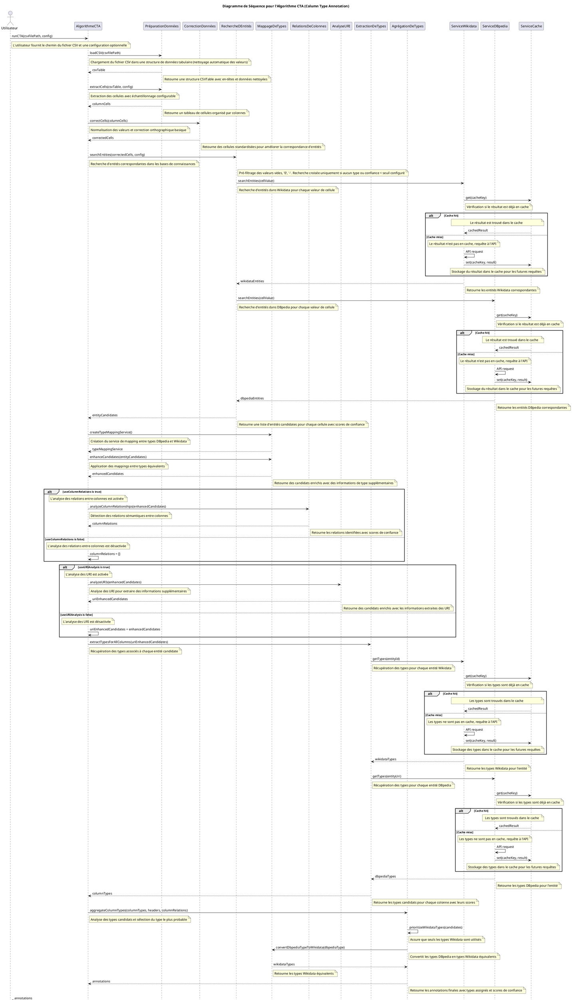

## Diagramme de Séquence

```plantuml
@startuml
title Diagramme de Séquence pour l'Algorithme CTA (Column Type Annotation)

actor "Utilisateur" as User
participant "AlgorithmeCTA" as CTAAlgorithm
participant "PréparationDonnées" as DataPreparation
participant "CorrectionDonnées" as DataCorrection
participant "RechercheDEntités" as EntitySearch
participant "MappageDeTypes" as TypeMapping
participant "RelationsDeColonnes" as ColumnRelationship
participant "AnalyseURI" as URIAnalysis
participant "ExtractionDeTypes" as TypeExtraction
participant "AgrégationDeTypes" as TypeAggregation
participant "ServiceWikidata" as WikidataService
participant "ServiceDBpedia" as DBpediaService
participant "ServiceCache" as CacheService

' L'utilisateur démarre le processus en appelant la fonction runCTA
User -> CTAAlgorithm : runCTA(csvFilePath, config)
note right of User : L'utilisateur fournit le chemin du fichier CSV et une configuration optionnelle

' Step 1: Data Preparation - Load CSV
CTAAlgorithm -> DataPreparation : loadCSV(csvFilePath)
note right of CTAAlgorithm : Chargement du fichier CSV dans une structure de données tabulaire (nettoyage automatique des valeurs)
DataPreparation --> CTAAlgorithm : csvTable
note right of DataPreparation : Retourne une structure CSVTable avec en-têtes et données nettoyées

' Step 1: Data Preparation - Extract cells
CTAAlgorithm -> DataPreparation : extractCells(csvTable, config)
note right of CTAAlgorithm : Extraction des cellules avec échantillonnage configurable
DataPreparation --> CTAAlgorithm : columnCells
note right of DataPreparation : Retourne un tableau de cellules organisé par colonnes

' Étape 2: Correction des données
CTAAlgorithm -> DataCorrection : correctCells(columnCells)
note right of CTAAlgorithm : Normalisation des valeurs et correction orthographique basique
DataCorrection --> CTAAlgorithm : correctedCells
note right of DataCorrection : Retourne des cellules standardisées pour améliorer la correspondance d'entités

' Étape 3: Recherche d'entités
CTAAlgorithm -> EntitySearch : searchEntities(correctedCells, config)
note right of CTAAlgorithm : Recherche d'entités correspondantes dans les bases de connaissances
note right of EntitySearch : Pré-filtrage des valeurs vides, '0', '-'. Recherche croisée uniquement si aucun type ou confiance < seuil configuré

' Recherche dans Wikidata
EntitySearch -> WikidataService : searchEntities(cellValue)
note right of EntitySearch : Recherche d'entités dans Wikidata pour chaque valeur de cellule
WikidataService -> CacheService : get(cacheKey)
note right of WikidataService : Vérification si le résultat est déjà en cache

alt Cache hit
    note over CacheService, WikidataService : Le résultat est trouvé dans le cache
    CacheService --> WikidataService : cachedResult
else Cache miss
    note over WikidataService : Le résultat n'est pas en cache, requête à l'API
    WikidataService -> WikidataService : API request
    WikidataService -> CacheService : set(cacheKey, result)
    note over WikidataService, CacheService : Stockage du résultat dans le cache pour les futures requêtes
end

WikidataService --> EntitySearch : wikidataEntities
note right of WikidataService : Retourne les entités Wikidata correspondantes

' Recherche dans DBpedia
EntitySearch -> DBpediaService : searchEntities(cellValue)
note right of EntitySearch : Recherche d'entités dans DBpedia pour chaque valeur de cellule
DBpediaService -> CacheService : get(cacheKey)
note right of DBpediaService : Vérification si le résultat est déjà en cache

alt Cache hit
    note over CacheService, DBpediaService : Le résultat est trouvé dans le cache
    CacheService --> DBpediaService : cachedResult
else Cache miss
    note over DBpediaService : Le résultat n'est pas en cache, requête à l'API
    DBpediaService -> DBpediaService : API request
    DBpediaService -> CacheService : set(cacheKey, result)
    note over DBpediaService, CacheService : Stockage du résultat dans le cache pour les futures requêtes
end

DBpediaService --> EntitySearch : dbpediaEntities
note right of DBpediaService : Retourne les entités DBpedia correspondantes

EntitySearch --> CTAAlgorithm : entityCandidates
note right of EntitySearch : Retourne une liste d'entités candidates pour chaque cellule avec scores de confiance

' Étape 4: Correspondance entre types
CTAAlgorithm -> TypeMapping : createTypeMappingService()
note right of CTAAlgorithm : Création du service de mapping entre types DBpedia et Wikidata
TypeMapping --> CTAAlgorithm : typeMappingService

CTAAlgorithm -> TypeMapping : enhanceCandidates(entityCandidates)
note right of CTAAlgorithm : Application des mappings entre types équivalents
TypeMapping --> CTAAlgorithm : enhancedCandidates
note right of TypeMapping : Retourne des candidats enrichis avec des informations de type supplémentaires

' Étape 5: Analyse des relations entre colonnes (optionnel)
alt useColumnRelations is true
    note over CTAAlgorithm : L'analyse des relations entre colonnes est activée
    CTAAlgorithm -> ColumnRelationship : analyzeColumnRelationships(enhancedCandidates)
    note right of CTAAlgorithm : Détection des relations sémantiques entre colonnes
    ColumnRelationship --> CTAAlgorithm : columnRelations
    note right of ColumnRelationship : Retourne les relations identifiées avec scores de confiance
else useColumnRelations is false
    note over CTAAlgorithm : L'analyse des relations entre colonnes est désactivée
    CTAAlgorithm -> CTAAlgorithm : columnRelations = []
end

' Étape 6: Analyse des URI (optionnel)
alt useURIAnalysis is true
    note over CTAAlgorithm : L'analyse des URI est activée
    CTAAlgorithm -> URIAnalysis : analyzeURIs(enhancedCandidates)
    note right of CTAAlgorithm : Analyse des URI pour extraire des informations supplémentaires
    URIAnalysis --> CTAAlgorithm : uriEnhancedCandidates
    note right of URIAnalysis : Retourne des candidats enrichis avec les informations extraites des URI
else useURIAnalysis is false
    note over CTAAlgorithm : L'analyse des URI est désactivée
    CTAAlgorithm -> CTAAlgorithm : uriEnhancedCandidates = enhancedCandidates
end

' Étape 7: Extraction des types
CTAAlgorithm -> TypeExtraction : extractTypesForAllColumns(uriEnhancedCandidates)
note right of CTAAlgorithm : Récupération des types associés à chaque entité candidate

' Extraction des types depuis Wikidata
TypeExtraction -> WikidataService : getTypes(entityId)
note right of TypeExtraction : Récupération des types pour chaque entité Wikidata
WikidataService -> CacheService : get(cacheKey)
note right of WikidataService : Vérification si les types sont déjà en cache

alt Cache hit
    note over CacheService, WikidataService : Les types sont trouvés dans le cache
    CacheService --> WikidataService : cachedResult
else Cache miss
    note over WikidataService : Les types ne sont pas en cache, requête à l'API
    WikidataService -> WikidataService : API request
    WikidataService -> CacheService : set(cacheKey, result)
    note over WikidataService, CacheService : Stockage des types dans le cache pour les futures requêtes
end

WikidataService --> TypeExtraction : wikidataTypes
note right of WikidataService : Retourne les types Wikidata pour l'entité

' Extraction des types depuis DBpedia
TypeExtraction -> DBpediaService : getTypes(entityUri)
note right of TypeExtraction : Récupération des types pour chaque entité DBpedia
DBpediaService -> CacheService : get(cacheKey)
note right of DBpediaService : Vérification si les types sont déjà en cache

alt Cache hit
    note over CacheService, DBpediaService : Les types sont trouvés dans le cache
    CacheService --> DBpediaService : cachedResult
else Cache miss
    note over DBpediaService : Les types ne sont pas en cache, requête à l'API
    DBpediaService -> DBpediaService : API request
    DBpediaService -> CacheService : set(cacheKey, result)
    note over DBpediaService, CacheService : Stockage des types dans le cache pour les futures requêtes
end

DBpediaService --> TypeExtraction : dbpediaTypes
note right of DBpediaService : Retourne les types DBpedia pour l'entité

TypeExtraction --> CTAAlgorithm : columnTypes
note right of TypeExtraction : Retourne les types candidats pour chaque colonne avec leurs scores

' Étape 8: Agrégation et vote
CTAAlgorithm -> TypeAggregation : aggregateColumnTypes(columnTypes, headers, columnRelations)
note right of CTAAlgorithm : Analyse des types candidats et sélection du type le plus probable

' Priorité aux types Wikidata
TypeAggregation -> TypeAggregation : prioritizeWikidataTypes(candidates)
note right of TypeAggregation : Assure que seuls les types Wikidata sont utilisés

' Conversion des types DBpedia en types Wikidata si nécessaire
TypeAggregation -> TypeMapping : convertDbpediaTypeToWikidata(dbpediaType)
note right of TypeAggregation : Convertit les types DBpedia en types Wikidata équivalents
TypeMapping --> TypeAggregation : wikidataTypes
note right of TypeMapping : Retourne les types Wikidata équivalents

TypeAggregation --> CTAAlgorithm : annotations
note right of TypeAggregation : Retourne les annotations finales avec types assignés et scores de confiance

' Retour des résultats à l'utilisateur
CTAAlgorithm --> User : annotations
note right of CTAAlgorithm : Retourne les annotations de type de colonne à l'utilisateur

' Sauvegarde des annotations
User -> CTAAlgorithm : saveAnnotations(annotations, outputPath)
note right of User : L'utilisateur demande la sauvegarde des annotations au format JSON
CTAAlgorithm --> User : saved to JSON
note right of CTAAlgorithm : Confirmation de la sauvegarde au format JSON

User -> CTAAlgorithm : saveAnnotationsToCSV(annotations, csvFilePath)
note right of User : L'utilisateur demande la sauvegarde des annotations au format CSV
CTAAlgorithm --> User : saved to CSV
note right of CTAAlgorithm : Confirmation de la sauvegarde au format CSV
@enduml
```
